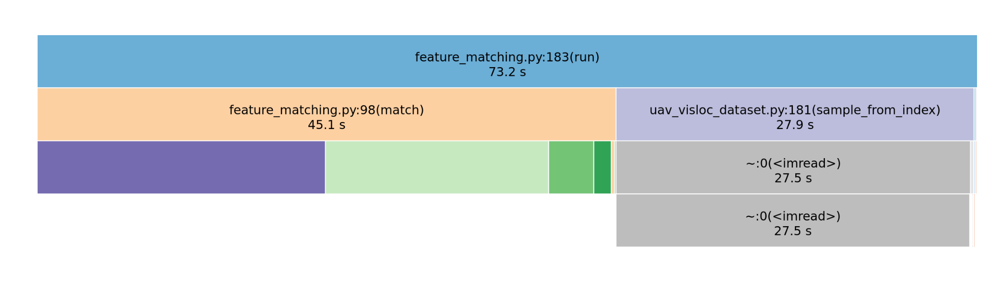
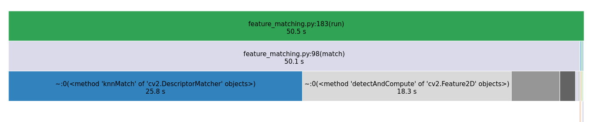

# Shared memory dataset io
```
__shm_dataset_io_version__ = "0.1.0"

"""
decode and load a directory of images into shared memory

the consumer only needs to know the filepath, len and shape is metadata in shm 

server usage:
    ShmDataset.load_from_path(Path("/home/user/datasets/UAV_VisLoc_dataset/04/drone"))

consumer usage:
    sdc = ShmDatasetConsumer(Path("/home/user/datasets/UAV_VisLoc_dataset/04/drone"))
    ms, n, h, w, c = struct.unpack_from("5i", sdc._shm.buf)
    print(f"{n} images of: {h}x{w}x{c}")
    cv2.imshow("", sdc.data[0]); cv2.waitKey(0)
    sdc.cleanup()

notes:
    all images must be same size

"""
```

## UAV-VisLoc example
Location 4 is `620MB` of `.jpeg`: `3976x2652, components 3`.

Even with everything in RAM:
```
vmtouch ~/datasets/UAV_VisLoc_dataset/04/drone/
           Files: 738
     Directories: 1
  Resident Pages: 158461/158461  618M/618M  100%
         Elapsed: 0.011063 seconds
```
OpenCV CPU decoding from `620MB` to around `21GB` takes a substantial amount of time:


### Before: 
<p align="center">

</p>

## After:
<p align="center">

</p>


